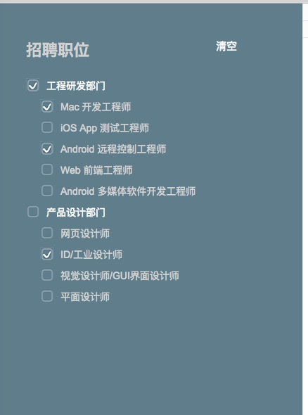

# React-Demo

### 基于Reactjs && Node 通讯的简单演示

* Reactjs && ES6 && webpack构建
* 基于文件系统的Node.js服务端

*需求


*效果图



## 安装与运行程序

克隆项目

```
> $ git clone https://github.com/lizzyl/react-checkbox-test.git
```

分别进入react目录和server目录下安装依赖包

```
> $ npm install
```

在server目录下启动后台服务

```
> $ npm run start
```

在react目录下启动webpack服务

```
> $ npm run dev
```

发布项目文件命令

```
> $ npm run build
```

执行完`npm run dev`命令后，打开浏览器 `http://localhost:8080/`运行项目，后台服务端口为 `3000`

## 后台接口（jsonp请求）
轮播图模块
```
http://localhost:3000/data/recruitment
```


